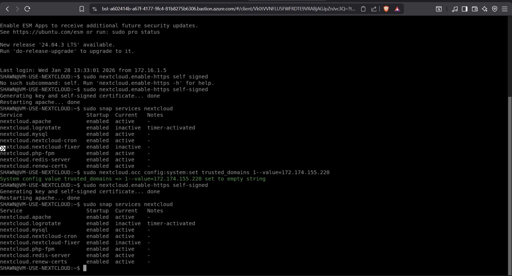
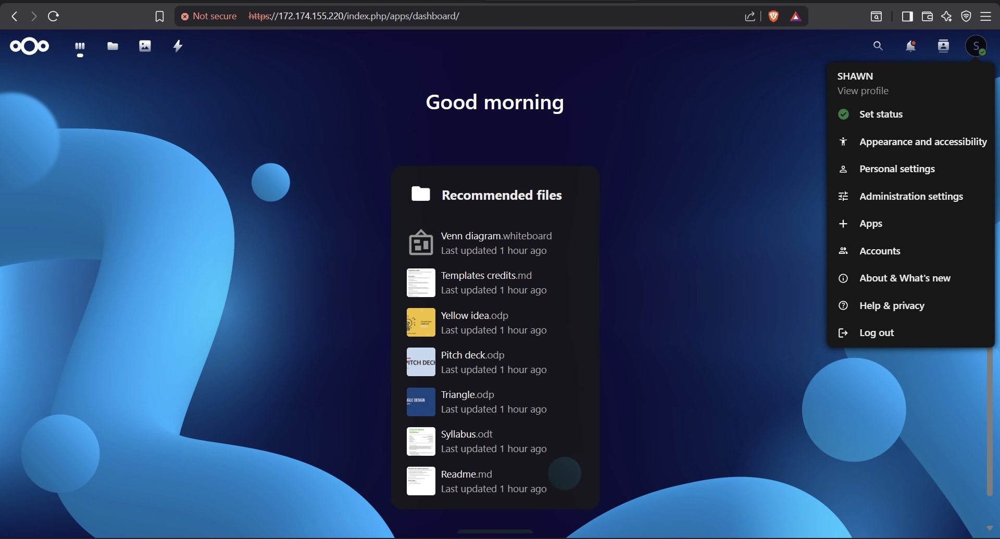

# 🌐 Create a Virtual Machine and Deploy a Web Server (Azure)
## 📸 Screenshots

### 1. Azure Resource Group Overview
Shows the full set of resources provisioned for the Nextcloud deployment, including VM, Bastion, NSG, VNet, and associated public IPs — all located in East US.


---

### 2. Virtual Machine Overview
Details of the VM named `VM-USE-NEXTCLOUD`, running Ubuntu 22.04 in East US Zone 2. Includes specs, public/private IPs, and networking setup.


---

### 3. Bastion status
Terminal session via Azure Bastion showing HTTPS self-signed certificate setup, service status checks, and trusted domain configuration.


)

---

### 4. Nextcloud Web Dashboard
Live view of the Nextcloud dashboard accessed via public IP. Displays recommended files and user menu under the account "SHAWN".



## 📌 Project Overview
This project demonstrates how to create a **Linux Virtual Machine in Microsoft Azure** and deploy a **web server** to host a simple webpage.  
It is based on hands-on labs commonly found in **Coursera cloud and IT support programs** and showcases foundational **cloud engineering** skills.

---

## 🛠️ Technologies & Tools Used
- Microsoft Azure
- Azure Virtual Machines
- Ubuntu Linux
- Apache Web Server
- SSH
- GitHub

---

## 🎯 Skills Demonstrated
- Virtual machine provisioning
- Linux command-line basics
- Web server installation and configuration
- Networking & firewall rules
- Cloud infrastructure fundamentals

---

## 📋 Prerequisites
Before starting, make sure you have:
- An Azure account
- Basic familiarity with:
  - Linux commands
  - Cloud concepts (VMs, networking)
- SSH client (Azure Cloud Shell or local terminal)

---

## 🚀 Step-by-Step Implementation

### Step 1: Create a Resource Group
1. Sign in to the Azure Portal
2. Navigate to **Resource Groups**
3. Click **Create**
4. Enter:
   - Resource Group Name: `webserver-rg`
   - Region: `East US` (or closest available region)
5. Click **Review + Create**
6. Click **Create**

---

### Step 2: Create a Virtual Machine
1. Navigate to **Virtual Machines**
2. Click **Create → Azure Virtual Machine**
3. Configure the VM:
   - Resource Group: `webserver-rg`
   - VM Name: `webserver-vm`
   - Image: **Ubuntu Server 20.04 LTS**
   - Size: `Standard_B1s` (or closest available option)
   - Authentication: **SSH public key**
4. Allow inbound ports:
   - SSH (22)
   - HTTP (80)
5. Click **Review + Create**
6. Click **Create**

---

### Step 3: Connect to the Virtual Machine
1. Go to the VM overview page
2. Copy the **Public IP Address**
3. Connect using SSH:
   ```bash
   ssh azureuser@<public-ip-address>

## Step 4: Update the Virtual Machine
After connecting to the virtual machine, update the system packages to ensure the OS is fully up to date.

```bash
sudo apt update
sudo apt upgrade -y

## Step 5: Install Apache Web Server
After updating the virtual machine, install the Apache web server. Apache will be used to host and serve the webpage from the virtual machine.

Run the following command to install Apache:

```bash
sudo apt install apache2 -y
Once the installation is complete, verify that the Apache service is running:
sudo systemctl status apache2

## Step 6: Configure Firewall Rules

To allow users to access the web server from the internet, HTTP traffic must be permitted through the firewall.

Run the following command to allow Apache traffic:
sudo ufw allow 'Apache'


## Step 7: Create a Custom Web Page
Run the following commands to navigate to the Apache web root directory and replace the default webpage with a custom HTML page.

```bash
cd /var/www/html

sudo tee index.html > /dev/null <<'EOF'
<html>
  <head>
    <title>Azure Web Server</title>
  </head>
  <body>
    <h1>It works!</h1>
    <p>This web server is running on an Azure Virtual Machine.</p>
  </body>
</html>
EOF


## Step 8: Test the Web Server

Verify that the Apache web server is serving the webpage correctly.

First, confirm Apache is running:
sudo systemctl status apache2

Next, retrieve the public IP address of the virtual machine (from the Azure Portal), then open a browser and navigate to:
https://172.174.155.220

If the configuration is successful, the custom webpage will be displayed. (Vm will be turned off so it probably wont display)
